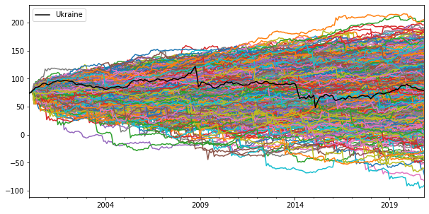
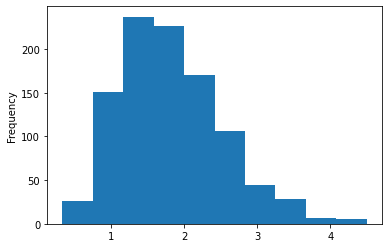

# QADF
The module provides access to a quantile augmented Dickey-Fuller unit root procedure. The test performs unit root quantile autoregression inference following the Koenker and Xiao (2004) methodology.

Parts of the code/logic such as formulas for the bandwidth and critical values (Hansen, 1995) were written using the qradf function (by Saban Nazlioglu) in the Aptech GAUSS tspdlib library as a reference.

## Usage
```python
y = pd.read_csv('examples.csv', index_col=0, squeeze=True)
y.index = pd.date_range('2000-01-01', '2020-11-01', freq='MS')
qADF = QADF(model='c', pmax=5, ic='AIC')
qADF.fit(y, tau=0.42)
qADF.summary()
```

    quantile: 0.42
    Lags: 2
    α₀(τ): 2.15
    ρ₁(τ): 0.973
    ρ₁(OLS): 0.968
    δ²: 0.278
    tₙ(τ): -2.916
    CV10%: -2.027126462017193
    CV5%: -2.373528690016954
    CV1%: -3.0307336125563666

## Notebook example
```python
import numpy as np
import pandas as pd
import time
import matplotlib.pyplot as plt
from quantileADF import QADF, bootstraps

import warnings
from statsmodels.tools.sm_exceptions import IterationLimitWarning
warnings.simplefilter('ignore', IterationLimitWarning)
```


```python
y = pd.read_csv('examples.csv', index_col=0, squeeze=True)
y.index = pd.date_range('2000-01-01', '2020-11-01', freq='MS')
```


```python
y.head()
```


    2000-01-01    74.340017
    2000-02-01    75.456058
    2000-03-01    78.506961
    2000-04-01    80.907992
    2000-05-01    84.377459
    Freq: MS, Name: Ukraine, dtype: float64


```python
qADF = QADF(model='c', pmax=5, ic='AIC')
qADF.fit(y, tau=0.42)
qADF.summary()
```

    quantile: 0.42
    Lags: 2
    α₀(τ): 2.15
    ρ₁(τ): 0.973
    ρ₁(OLS): 0.968
    δ²: 0.278
    tₙ(τ): -2.916
    CV10%: -2.027126462017193
    CV5%: -2.373528690016954
    CV1%: -3.0307336125563666

```python
quantiles = np.arange(0.1, 1, 0.1)
CountryQADF = qADF.fitForQuantiles(y, quantiles)
CountryQADF
```

<table border="1" class="dataframe">
  <thead>
    <tr style="text-align: right;">
      <th></th>
      <th>Lags</th>
      <th>α₀(τ)</th>
      <th>ρ₁(τ)</th>
      <th>ρ₁(OLS)</th>
      <th>δ²</th>
      <th>tₙ(τ)</th>
      <th>CV10%</th>
      <th>CV5%</th>
      <th>CV1%</th>
      <th>QKS</th>
      <th>name</th>
    </tr>
    <tr>
      <th>quantile</th>
      <th></th>
      <th></th>
      <th></th>
      <th></th>
      <th></th>
      <th></th>
      <th></th>
      <th></th>
      <th></th>
      <th></th>
      <th></th>
    </tr>
  </thead>
  <tbody>
    <tr>
      <th>0.1</th>
      <td>2</td>
      <td>-2.304</td>
      <td>1.002</td>
      <td>0.968</td>
      <td>0.328</td>
      <td>0.058</td>
      <td>-2.088537</td>
      <td>-2.429807</td>
      <td>-3.083911</td>
      <td>2.681</td>
      <td>Ukraine</td>
    </tr>
    <tr>
      <th>0.2</th>
      <td>2</td>
      <td>-0.096</td>
      <td>0.991</td>
      <td>0.968</td>
      <td>0.307</td>
      <td>-0.558</td>
      <td>-2.064626</td>
      <td>-2.406581</td>
      <td>-3.067762</td>
      <td>2.681</td>
      <td>Ukraine</td>
    </tr>
    <tr>
      <th>0.3</th>
      <td>2</td>
      <td>1.330</td>
      <td>0.978</td>
      <td>0.968</td>
      <td>0.289</td>
      <td>-2.061</td>
      <td>-2.041454</td>
      <td>-2.385845</td>
      <td>-3.045965</td>
      <td>2.681</td>
      <td>Ukraine</td>
    </tr>
    <tr>
      <th>0.4</th>
      <td>2</td>
      <td>2.021</td>
      <td>0.974</td>
      <td>0.968</td>
      <td>0.280</td>
      <td>-2.681</td>
      <td>-2.028772</td>
      <td>-2.374943</td>
      <td>-3.032483</td>
      <td>2.681</td>
      <td>Ukraine</td>
    </tr>
    <tr>
      <th>0.5</th>
      <td>2</td>
      <td>2.219</td>
      <td>0.975</td>
      <td>0.968</td>
      <td>0.277</td>
      <td>-2.512</td>
      <td>-2.025065</td>
      <td>-2.371757</td>
      <td>-3.028542</td>
      <td>2.681</td>
      <td>Ukraine</td>
    </tr>
    <tr>
      <th>0.6</th>
      <td>2</td>
      <td>2.597</td>
      <td>0.976</td>
      <td>0.968</td>
      <td>0.266</td>
      <td>-2.016</td>
      <td>-2.009642</td>
      <td>-2.358499</td>
      <td>-3.012146</td>
      <td>2.681</td>
      <td>Ukraine</td>
    </tr>
    <tr>
      <th>0.7</th>
      <td>2</td>
      <td>3.391</td>
      <td>0.972</td>
      <td>0.968</td>
      <td>0.250</td>
      <td>-2.058</td>
      <td>-1.986725</td>
      <td>-2.338800</td>
      <td>-2.987783</td>
      <td>2.681</td>
      <td>Ukraine</td>
    </tr>
    <tr>
      <th>0.8</th>
      <td>2</td>
      <td>2.856</td>
      <td>0.986</td>
      <td>0.968</td>
      <td>0.228</td>
      <td>-0.969</td>
      <td>-1.955893</td>
      <td>-2.312298</td>
      <td>-2.955006</td>
      <td>2.681</td>
      <td>Ukraine</td>
    </tr>
    <tr>
      <th>0.9</th>
      <td>2</td>
      <td>4.874</td>
      <td>0.973</td>
      <td>0.968</td>
      <td>0.168</td>
      <td>-1.232</td>
      <td>-1.865309</td>
      <td>-2.227611</td>
      <td>-2.873084</td>
      <td>2.681</td>
      <td>Ukraine</td>
    </tr>
  </tbody>
</table>

```python
repetitions = 1000
boots = bootstraps(y, lags=2, n_replications=repetitions)
```


```python
pd.DataFrame(boots).plot(kind='line', legend=False, figsize=(10,5))
y.plot(legend=True, color='black')
plt.show()
```




```python
%%time
results = pd.concat([qADF.fitForQuantiles(boots[yStar], quantiles) for yStar in boots])
```

    CPU times: user 19min 33s, sys: 12min 33s, total: 32min 6s
    Wall time: 18min 2s

```python
cvQKS = results.groupby('name')['QKS'].mean()
cvQKS.plot(kind='hist')
t = CountryQADF['QKS'][0.1]
conf_int = np.percentile((cvQKS), [90, 95, 99])
pValue = (cvQKS >= t).mean()

plt.show()
print('tₙ(τ):', CountryQADF['QKS'][0.1])
print('Confidence interval:',conf_int)
print('p-value:', pValue)
```





    tₙ(τ): 2.681
    Confidence interval: [2.7542  3.1293  3.74112]
    p-value: 0.115
